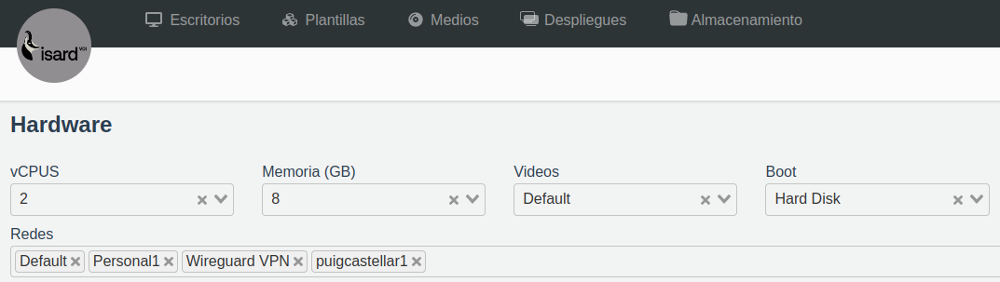
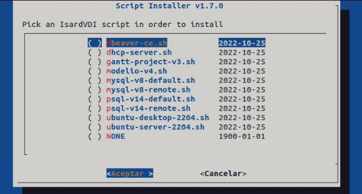

# isard-scripts
Template generation scripts for IsardVDI

## Requisites
The app can be installed within any IsardVDI's virtual machine running an Ubuntu (Server and Desktop) 22.04 LTS, but the network interfaces must be setup in the following order:
1. Default: the isolated IsardVDI network which provides internet access.
2. WireguardVPN: this network provides access through a tunnel, in order to connect any host local to the virtual machine. 
3. Personal1: this network allows connecting virtual machines to each other (must be owned by the same user).

<p align="center">
  
</p>

## How to install
The app can be installed within any IsardVDI's virtual machine running an Ubuntu (Server and Desktop) 22.04 LTS:

1. Deploy the app cloning the repo: `git clone https://github.com/FherStk/isard-scripts.git`
2. Then, install the app with **sudo** (it will be installed at /etc/isard-scripts):
```
cd isard-scripts
sudo ./install.sh
history -c
```
3. Shutdown the virtual machine and create a template from it. 

## How to run
1. The script's deployemnt prompt will be displayed on first boot (won't be disabled if the promt is cancelled), so the user will be able to choose which template must be deployed (select an option with space and `accept`) or do nothinc (`cancel`). The prompt can also be forced by running `sudo ./run.sh` after the user login.

<p align="center">
  
</p>


## How to test a script in develop
Please, follow this steps in order to test any script during development:

1. Start a clean machine and login
2. Cancel the script startup execution
3. Go to the git folder: `cd ~/isard-scripts`
4. Update the repo: `sudo git pull`
5. Set the current git branch to the one where you're developing the script: `sudo git checkout <branch_name>`
6. Test the script with `sudo ./scripts/<script_name.sh>` or the launcher with `sudo ./run.sh`
7. When done, perform a pull request and every machine will be updated on startup.
