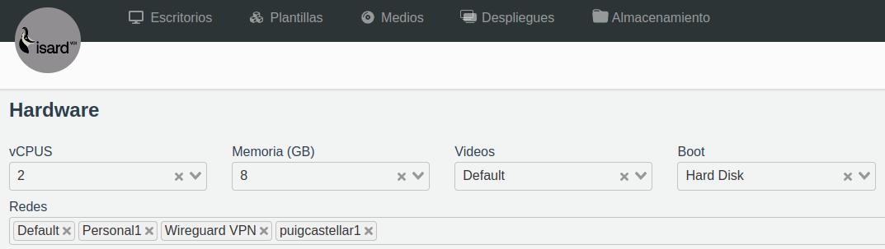
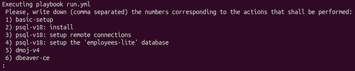

# isard-scripts
Template generation scripts for IsardVDI 

## Requisites
The app can be installed within any IsardVDI's virtual machine running an Ubuntu (Server and Desktop) 24.04 LTS & 26.04 LTS, but the network interfaces must be setup in the following order:
1. Default: the isolated IsardVDI network which provides internet access.
2. Personal1: this network allows connecting virtual machines to each other (must be owned by the same user).
3. WireguardVPN: this network provides access through a tunnel, in order to connect any host local to the virtual machine.
4. GroupNetwork1 (the name can be different in your instance): this network allows communication between machines within the same group, even from differents users. Notice that "group networks" can be named different in your case. 

<p align="center">
  
</p>

## How to install
The app can be installed within any IsardVDI's virtual machine running an Ubuntu (Server and Desktop) 22.04 LTS & 24.04 LTS:

1. Deploy the app cloning the repo: `git clone https://github.com/FherStk/isard-scripts.git`
1. Go to the repo folder: `cd isard-scripts`
1. Now to your current distro's folder: `cd ubuntu-26.04`
1. Then, install the app with **sudo** (it will be installed at /etc/isard-scripts) and clean the bash history:
```
sudo ./install.sh
```
1. Shutdown the virtual machine and create a template from it. 
1. The script's deployemnt prompt will be displayed on first boot.

## How to run manually
1. The script's deployemnt prompt can also be forced by running `sudo ./run.sh` after the user login within the installation path.

<p align="center">
  
</p>